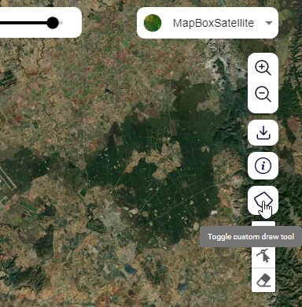
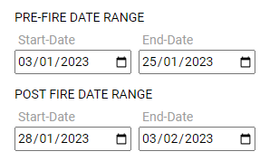

Calculate Forest Change
========================

Computing Forest Loss
_______________________

.. note::
   The current release of the MISLAND-North Africa uses the High resolution Hansen Global forest Change data to compute forest loss for selected area and year.

To compute forest loss using the Hansen Global forest change dataset;

1. On the top left conner of the Map pannel, click on the |sdgicon| tool to toggle the drowing tools. Once the drawing tools are revealed, click on the |drowpolygon| tool to start drowing a custom area on the map where you wish to compute the forest loss

    Draw a polygon tool

    Draw a polygon tool

2. Select |forestlossicon| and click on the layer settings icon |cog| . On the layer settings dialog, under the 'SELECT DATA SOURCE' options, choose 'Hansen' and select the year you wish to compute the forest loss.

    Selecting the Hansen Forest loss data

On clicking |submit| The map and computed statistics will be displayed on the map panel and summary pannel respectively.

.. figure:: ../_static/Images/Service/hansenoutput.png
    :width: 705
    :align: center
    :height: 325
    :alt: register
    :figclass: align-center

    Foret change outputs

Computing Forest Fires
_______________________

1. Select the |forestchangeicon| option from the service menu. Under the |forestfireassesmenticon| click on the |cog| icon to toggle the layer settings as shown below.

    Selecting the Forest-fires option from the service menu.

2. On the output layer options, select the pre and post fire dates using the calender

    Selecting the date from the calender tool.

    Pre-fire and Post-fire dates

3. Choose the platform to use to compute the burnt area

.. figure:: ../_static/Images/Service/platform.png
    :width: 326
    :align: center
    :height: 336
    :alt: register
    :figclass: align-center

    Choosing the Platform/Sensor for computing forest fires.

The output showing the extent and severity of the fire will be as shown below

    Forest-fire Output.    

.. toctree::
   :maxdepth: 3

.. |cog| image:: ../_static/Images/Service/cog.png
.. |submit| image:: ../_static/Images/Service/submit.png

