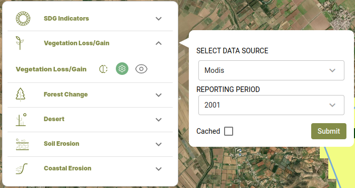
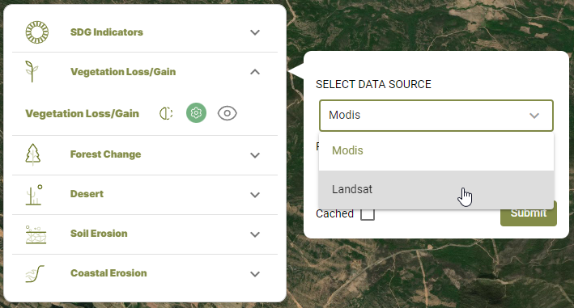
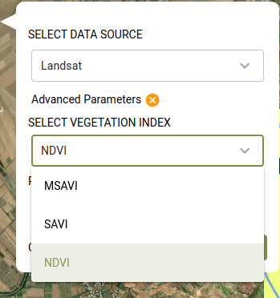
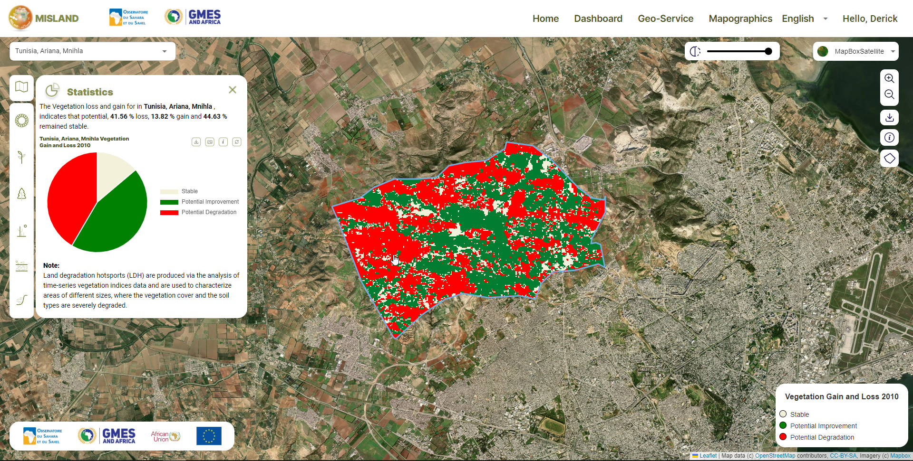

Calculate Vegetation Loss/Gain indicators
==========================================

To compute vegetation loss/gain on the service platform,

1. On the services menu, select the |veglossicon| option 

    Selecting the vegetation Loss/Gain Service

2. Click on the |cog| icon to open the layer settings dialog and select the data source and reporting year as shown below.

    Vegetation gain/loss outputs

To compute vegetation indices using Landsat derived vegetation indices(NDVI, MSAVI, SAVI), 

1. On the Vegetation loss/gain dialog, select Landsat under the SELECT DATA SOURCE dropdown and click on the |advancedparameters| options to access the list of indices.

    Selecting the Landsat-derived vegetation index option

2. select the vegetation index form the SELECT VEGEATATION INDEX dropdown that is revealed. Select the reporting period before clicking on the |submit| button.

    Choosing the vegetation index to compute

The map and computed statistics will be displayed on the map panel and summary pannel respectively.

    Landsat derived vegetation loss and gain output

.. toctree::
   :maxdepth: 3

.. |submit| image:: ../_static/Images/Service/submit.png

