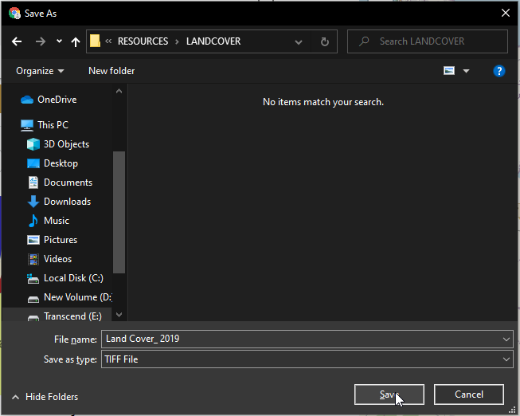

Download data
==============
In addition to exporting charts as an option, users can also downlad the data and create custom charts or perform further analyses.

The download data icon |downloaddataicon| icon can be found just below the summary text under the statistics panel as in the figure below.

    Download CSV file option

The downloaded data is in .csv format and can be open in microsoft exel or similar software

.. figure:: ../_static/Images/Service/download1.png
    :width: 355
    :align: center
    :height: 458
    :alt: Export data as CSV
    :figclass: align-center

    Exported data as CSV

Downloading Raster Data
________________________

MISLAND Service users can also download the data in GeoTIF format for further analysis or visualization

To download the raster data, Click on the download tiff just below the service menu-bar as shown below

.. figure:: ../_static/Images/Service/download2.png
    :width: 209
    :align: center
    :height: 85
    :alt: download raster (GeoTIFF)
    :figclass: align-center

    Download tiff file option

This will prompt you to save the file in your desired location. The downloaded raster can be visualized and analysed with your desired software or tools.

    Saving the downloaded tiff

.. |downloaddataicon| image:: ../_static/Images/Service/downloaddataicon.png