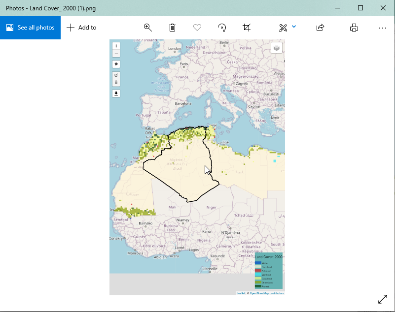

Exporting Outputs
=================
Exporting outputs on the service is as simple and intuitive. Users can download the maps, charts and data following the steps highligted in this section of the document.

Export Map
___________
Map outputs can be exported in .png format. To export the map, users can click on the export map tool that is found on the map navigation tools as shown below.

    Image file of exported map

Export Chart
_____________
The chart image can be exported from the statistics tab by clicking on the export image icon |exportimageicon| on the list of icons at the top-right conner of the chart area.

    Export chart as image

An example of an image file export is shown below.

    Export chart as image

